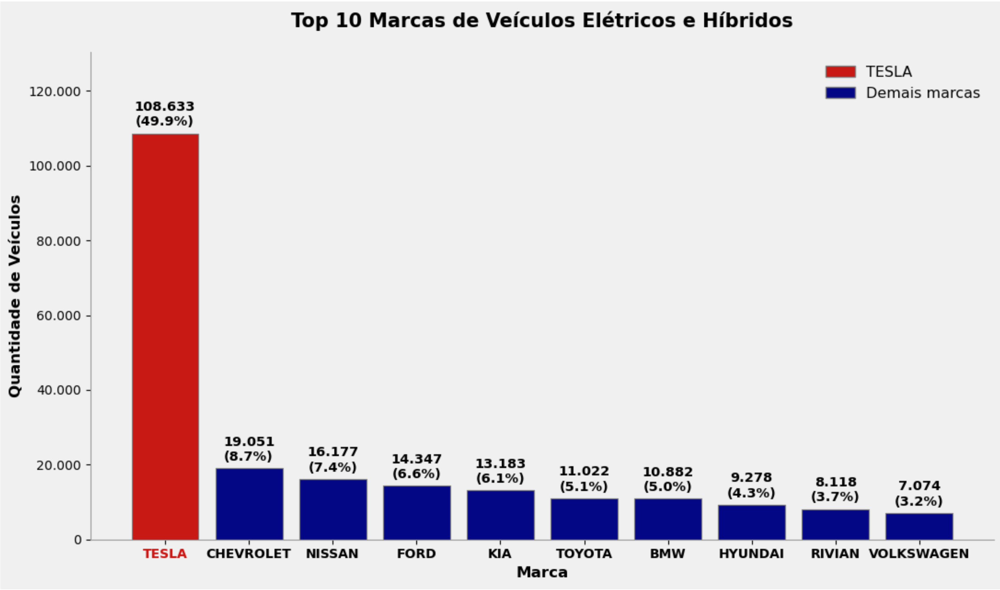
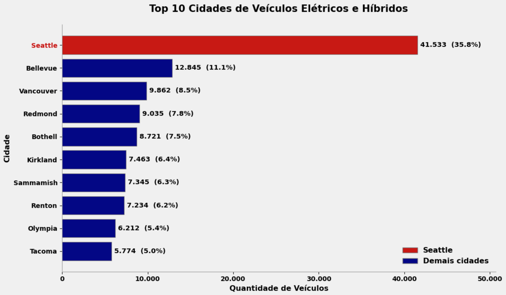
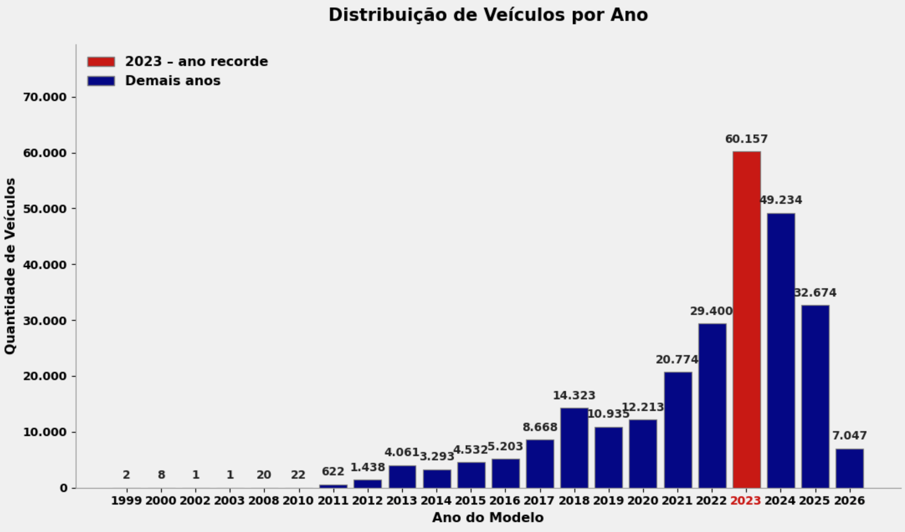
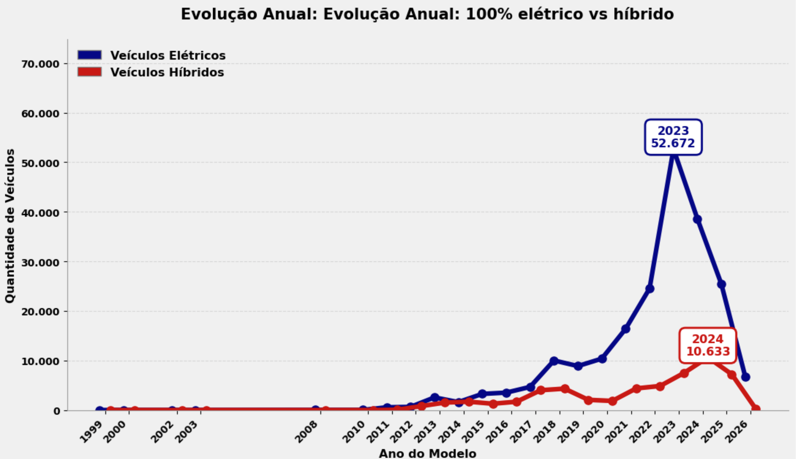
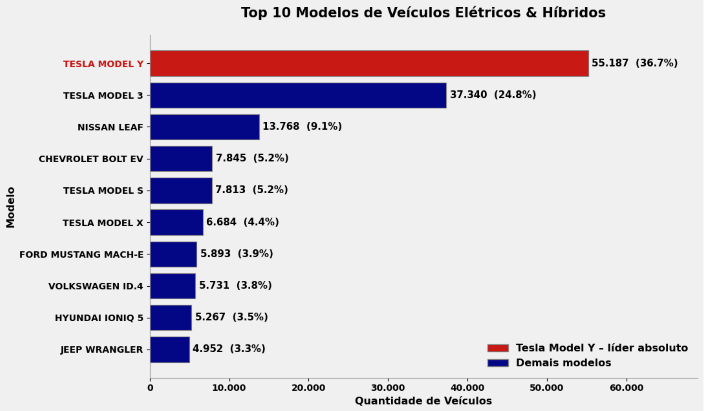
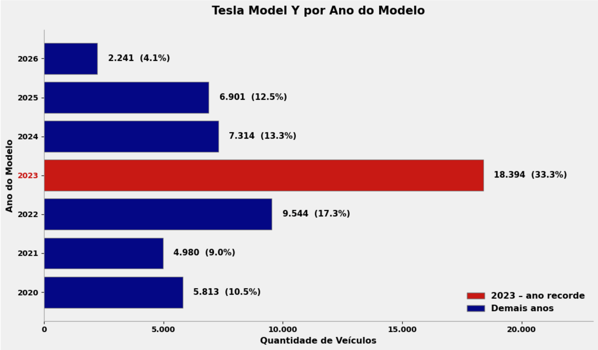

### Insight 1: Liderança Absoluta da Tesla
 
O primeiro gráfico (Célula 9) apresenta o ranking das 10 principais marcas de veículos elétricos e híbridos em Washington.
A **Tesla** lidera com folga: **108.633 veículos registrados**, o equivalente a **49,9
%** do total das dez marcas mais vendidas. Isso significa que praticamente **1 em cada 2 carros no Top 10 é um Tesla.
A segunda colocada, **Chevrolet**, tem apenas **19.051 unidades** (8,7 %), uma diferença de **41,2 pontos percentuais** em relação à líder. Nissan (7,4 %) e Ford (6,6%) completam o pódio, mas ainda distantes.
A Tesla não tem concorrente à altura, ela simplesmente domina o mercado de elétricos em Washington.

### Insight 2: Concentração Geográfica: O Domínio de Seattle
 
O segundo gráfico apresenta a distribuição dos veículos elétricos e híbridos entre as 10 principais cidades de Washington.
**Seattle** lidera com folga: **41.533 veículos**, o equivalente a **35,8 %** do total das dez cidades, mais de um terço de todos os veículos  do Top 10 está concentrado na cidade.
Em segundo e terceiro lugares aparecem **Bellevue** (12.845 unidades, 11,1 %) e **Vancouver** (9.862 unidades, 8,5 %), números que ainda ficam muito distantes.
Seattle é a **cidade mais populosa** do estado (780.995 habitantes em 2024) e tem a **maior renda mediana familiar** de Washington (US$ 121.984 em 2023, 55 % acima da média estadual). 
Essa combinação de população grande + poder de compra elevado explica perfeitamente por que a capital concentra tanto os veículos elétricos e híbridos.

### Insight 3: O Ano Recorde
 
O terceiro gráfico mostra a evolução dos registros por ano do modelo.
2023 foi o ano recorde: **60.157** veículos elétricos e híbridos registrados, quase o dobro de 2022 (29.400) e **três vezes mais que 2021 (20.774)**.
O principal motivo foi a combinação de incentivos federais de até US$ 7.500 (Lei de Redução da Inflação) com incentivos estaduais de até US$ 4.000, que foram introduzidos em 2023.
Em 2024 os registros caíram para 49.234, ainda um número muito alto, mas 18 % abaixo do pico de 2023.

### Insight 4: Evolução da Frota: A Preferência pelo 100% Elétrico
 
O quarto gráfico acompanha a evolução anual dos **elétricos** e **híbridos** em Washington.
Até 2017 a disputa foi equilibrada. A partir de **2018** os veículos elétricos começam a abrir vantagem clara.
O ponto mais alto dessa tendência aconteceu em **2023**, ano recorde geral de vendas (Insight 3) e também o ano com a **maior distância histórica** entre os dois tipos: mais de 50 mil elétricos contra menos de 10 mil
híbridos.
Em **2024** os híbridos atingiram seu maior volume da série histórica (**10.633 unidades**).

### Insight 5: Dominância Incontestável
 
O Gráfico 5 (Top 10 Modelos) mostra que a liderança da Tesla não é apenas de marca, é concentrada em **dois modelos específicos**:

- **Tesla Model Y** → 55.187 unidades → **36,7 %** do Top 10
- **Tesla Model 3** → 37.340 unidades → **24,8 %** do Top 10

Juntos, **Model Y + Model 3 representam 61,5 %** de todos os veículos que aparecem no ranking dos 10 modelos mais registrados em Washington. 
Se ampliarmos para um Top 6, a Tesla coloca **quatro modelos** na lista (Y, 3, S e X). Nenhum outro fabricante consegue colocar mais de um modelo no Top 10.
Em Washington, comprar um veículo elétrico quase sempre significa comprar um **Tesla Model Y ou Model 3**. A marca não apenas domina, ela domina com apenas dois produtos.

### Insight 6: Dominância do Tesla Model Y
O Gráfico 6 mostra que o **Model Y** concentrou suas vendas nos anos recentes (2020 - 2026), com um pico em 2023, detalhado no Gráfico 4.
**De acordo com o Washington State Department of Ecology**: “Os incentivos federais de até US$ 7.500 da Lei de Redução da Inflação, somados a até US$ 4.000 de incentivos estaduais, tornaram os veículos de emissão zero mais acessíveis do que nunca.”
Esse combo de redução de taxas do governo explica por que 2023 foi o ano em que o Model Y “decolou” no estado.


### Dataset (64 MB)
Link direto: 
→ [Electric_Vehicle_Population_Data.csv](https://catalog.data.gov/dataset/electric-vehicle-population-data/resource/fa51be35-691f-45d2-9f3e-535877965e69)


## Fontes
- Wikipedia - [Seattle](https://en.wikipedia.org/wiki/Seattle)
- U.S. Census Bureau → [Seattle city, Washington](https://www.census.gov/quickfacts/fact/table/seattlecitywashington/EDU685223)
- Washington State Department of Ecology (2024) → [A record year for electric and plug-in hybrid vehicles in Washington](https://ecology.wa.gov/blog/april-2024/a-record-year-for-electric-vehicles-and-plug-in-hybrids-in-washington)
- Dataset oficial → [Washington electric and plug-in vehicle sales increased in 2023](https://www.nbcrightnow.com/news/washington-electric-and-plug-in-vehicle-sales-increased-in-2023/article_d6017f50-d915-543c-9944-36b7873c3480.html)


## Gráficos







## Como rodar
```bash
git clone https://github.com/PabloAim/washington-electric-vehicles.git
cd washington-electric-vehicles
pip install pandas matplotlib jupyter
jupyter notebook
